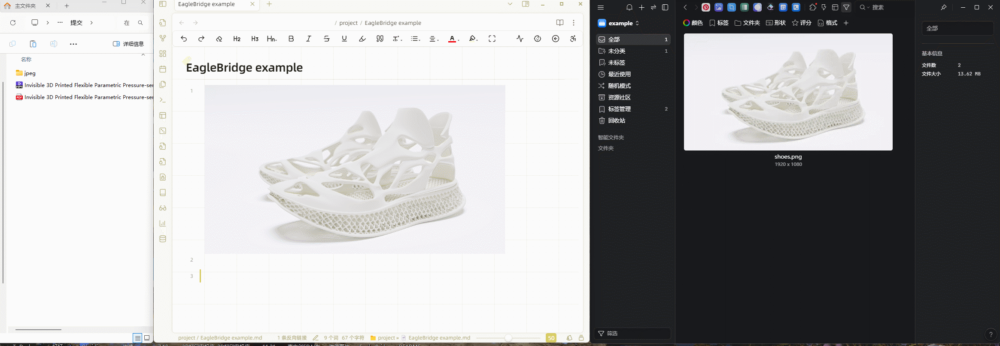

# Obsidian EagleBridge

【[中文](./doc/ReadmeZH.md) / EN】

This is a sample plugin for Obsidian, designed to integrate Obsidian with the Eagle software.

[eagle](https://eagle.cool) is a powerful attachment management software that allows for easy management of large quantities of images, videos, and audio materials, suitable for various scenarios such as collection, organization, and search. It supports Windows systems.

## Features Overview

This plugin includes the following functionalities:

- Quick eagle attachment navigation in Obsidian
- Tag synchronization
- File viewing
- Attachment management

 

## Initial Setup Instructions

1. **Configure the Listening Port**: Set a four-digit, complex value between 1000 and 9999 (e.g., 6060) to avoid conflicts with common port numbers. Once set, it is recommended not to change it to ensure stable attachment links.

2. **Set Eagle Library Location**: Select the library in the top left corner of the Eagle software and copy its path, for example: `D:\onedrive\eagle\Library`.

You need to restart Obsidian after completing these configurations, and then you can start using the plugin.

## Showcase

### Load Attachments from Eagle

### Upload Local Attachments to Eagle via EagleBridge and View in Obsidian

## Installation Instructions

### Install via BRAT

Add `https://github.com/zyjGraphein/Obsidian-EagleBridge` to [BRAT](https://github.com/TfTHacker/obsidian42-brat).

### Manual Installation

Visit the latest release page, download `main.js`, `manifest.json`, and `style.css`, then place them into `<your_vault>/.obsidian/plugins/EagleBridge/`.

## Usage Guide

- Text Tutorial ([中文](./doc/TutorialZH.md) / [EN](./doc/Tutorial.md))
- Video Tutorial ([等待替换](https://www.bilibili.com))

### Notes
- When using the plugin, Eagle must be running in the background, and the open state should correspond to the repository at the specified path.
- If Eagle is not running or is not in the target path repository, you can still view images, but the context menu functions and attachment uploads to Eagle will not work.
- When exporting notes as a PDF, images will display correctly, but other links (URLs, PDFs, MP4s) will still be clickable. However, when shared with others (outside the local environment), these links may not open.

## Development Guide

This plugin follows the structure of the [Obsidian Sample Plugin](https://github.com/obsidianmd/obsidian-sample-plugin). More details can be found there.

- Clone this repository
- Ensure your NodeJS is at least v16 (`node --version`)
- Run `npm i` or `yarn` to install dependencies
- Run `npm run dev` to start the compiler in watch mode

## To-Do List

- [x] Support embedded previews for various file formats (e.g., PDF, MP4, PSD, OBJ, etc.)
- [ ] Add support for macOS.
- [ ] Support updating position when dragging.
- [ ] When exporting, replace all attachment links and export all attachments to a folder.

## Known Limitations

Currently, there is no effective method to prevent accidental deletion of attachments when traversing all file references. It is recommended to delete within Eagle and use ID retrieval to remove links in `.md` files.

## Issues and Suggestions

You are welcome to submit issues for:

- Bug reports
- Ideas for new features
- Optimizations for existing features

If you are considering developing a large feature, please contact me first so we can determine if it is a good fit for this plugin.

## Credits
This plugin also utilizes API calls from [eagle](https://api.eagle.cool/) to enable viewing, editing, and uploading of Eagle content.

The right-click functionality and image zooming in this plugin draw inspiration from [AttachFlow](https://github.com/Yaozhuwa/AttachFlow)

Video and PDF external link embedding previews are inspired by the corresponding features of [auto-embed](https://github.com/GnoxNahte/obsidian-auto-embed).

Additionally, it is also inspired by some features from[PicGo+Eagle+Python](https://zhuanlan.zhihu.com/p/695526765), [obsidian-auto-link-title](https://github.com/zolrath/obsidian-auto-link-title) and [obsidian-image-auto-upload-plugin](https://github.com/renmu123/obsidian-image-auto-upload-plugin). 

Additionally, support from the Obsidian forum ([get-the-source-path-when-drag-and-drop-or-copying-a-file-image-from-outside](https://forum.obsidian.md/t/how-to-get-the-source-path-when-drag-and-drop-or-copying-a-file-image-from-outside/96437)) helped in implementing the ability to capture file sources via copying or dragging.

## License

This project is licensed under the [GNU General Public License v3 (GPL-3.0)](https://github.com/zyjGraphein/EagleBridge/blob/master/LICENSE).

## Support

If you appreciate this plugin and want to say thanks, you can buy me a coffee!

