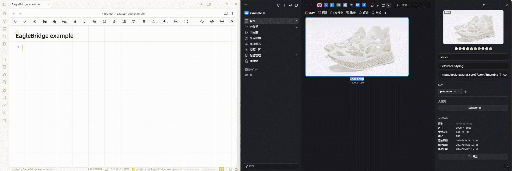
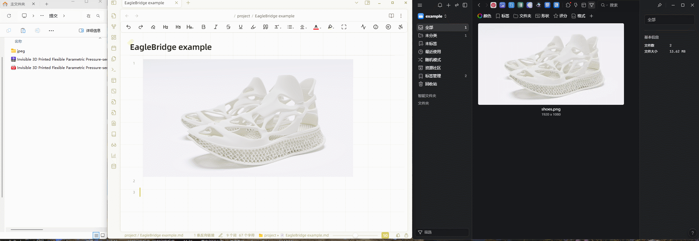

# Obsidian EagleBridge

EagleBridge 将 Obsidian 笔记与 Canvas 白板连接到 Eagle 管理的素材。

[eagle](https://eagle.cool) 是一款强大的附件管理软件，可以轻松管理大量图片、视频、音频素材，满足“收藏、整理、查找”的各类场景需求。EagleBridge 面向桌面端使用，当前重点支持 Windows 与 macOS。

## 功能概述

本插件的功能包括：

- 将 Eagle 素材拖入或粘贴到 Markdown、Canvas，并在 Obsidian 中预览。
- 最多连接 5 个 Eagle 素材库，支持多设备路径、上传目标选择及文件类型开关。
- 查看当前 Obsidian 库中的素材引用关系，修改素材属性，选择链接删除范围。
- 批量迁移当前文档的本地附件（包括视频）；将 Markdown 与 Eagle 附件导出为文件夹或 ZIP。
- 选择标签同步方向，配合 Eagle 端插件从素材回到笔记。
- 支持 obEcraft 联动，改进 Mac 路径、iCloud 导入、视频编辑与设置界面。
- 多个 Obsidian 库使用同一 Eagle 库及端口时共享预览服务，持有端口的窗口关闭后自动接管。

完整功能变化、使用范围及视频提纲见 [0.3.5 更新说明](../RELEASE_NOTES_0.3.5.md)。

## 初次使用配置说明

1. **添加 Eagle 素材库**：在插件设置中填写别名和固定预览端口（1000–65535，例如 6060）。不同 Eagle 库使用不同端口；多个 Obsidian 库连接同一个 Eagle 库时，设置相同端口即可共享预览服务。

2. **填写素材库路径**：从 Eagle 左上角的库选择器复制路径，例如：
   Windows：`D:\onedrive\eagle\仓库.library`
   macOS：`/Users/you/Pictures/Eagle/仓库.library`

3. **配置其他设备或素材库**：同一个 Eagle 库在不同设备上的路径填写在同一个配置内，自动使用第一个可访问路径。不同 Eagle 库分别建立配置，最多 5 个。

4. **选择上传方式**：固定使用默认 Eagle 库，或每次选择；Markdown、Canvas 与文件类型可分别开关。修改素材库配置后，预览服务会自动刷新。

同时打开的各个 Obsidian 库都需要更新并重载 EagleBridge，才能使用共享预览。已有笔记链接包含端口号，设置后请保持稳定。

## 示例展示

### 从 Eagle 中加载附件

### 从本地文件上传附件至 Eagle，并在 Obsidian 中查看

## 安装指南

### 通过 BRAT 安装

将 `https://github.com/zyjGraphein/Obsidian-EagleBridge` 添加到 [BRAT](https://github.com/TfTHacker/obsidian42-brat)。

### 手动安装

访问最新发布页面，下载 `main.js`、`manifest.json`、`styles.css`，然后将它们放入 `<your_vault>/.obsidian/plugins/EagleBridge/`。

## 使用指南

- 文字教程（[中文](../doc/TutorialZH.md) / [EN](../doc/Tutorial.md)）
- 视频教程（[Obsidian EagleBridge -bilibili](https://www.bilibili.com/video/BV1voQsYaE5W/?share_source=copy_web&vd_source=491bedf306ddb53a3baa114332c02b93)）

### 注意事项
- 文件上传需要 Eagle 4 或更新版本。插件直接使用 Eagle 返回的素材 ID 插入链接，不再监控或扫描整个素材库来查找新文件。iCloud 和外接硬盘中的素材仍需在本机可访问，才能显示预览。
- 从尚未配置的 Eagle 库拖入素材时，请先在设置中将该库添加为独立的素材库配置，避免重复导入到其他库。
- 上传和调用 Eagle API 的操作需要 Eagle 运行，插件会按需切换到目标素材库。Eagle 关闭时，只要素材文件在本机可访问，仍可使用本地预览和引用浏览。
- 笔记导出为 pdf，图片能够正常显示，但其他的链接（url, pdf, mp4）依旧能够正常点击打开，但分享给其他人（脱离本地）会无法打开。

### 批量迁移当前文档附件

在目标文档运行 **EagleBridge: Upload current Markdown attachments to Eagle**，也可在 **设置 → 快捷键** 中为此命令设置快捷键。命令处理当前文档正文里的本地附件引用，支持图片、视频及其他附件，同一个附件只上传一次。

视频按本地文件路径交给 Eagle，逐个导入，不会将整个视频读入 Obsidian 的 JavaScript 内存。成功后替换正文引用；核对 Eagle 副本且没有其他 Markdown、YAML 属性或 Canvas 引用时，将源附件移入回收站。部分失败不影响成功项；副本或引用无法确认时保留源文件并说明原因。

目前不跨多个文档运行，也不替换 YAML 属性里的路径。其他 YAML 数据保持原样。正文原本使用 `![[视频.mp4]]` 时会保留内嵌形式；普通链接仍是普通链接。第三方卡片视图的缩略图支持取决于对应插件，并非迁移后一定会显示。

视频嵌入在实时预览和阅读模式中默认暂停，点击播放控件后才开始；空文件名的 `` 也能识别视频。

在实时预览中，将鼠标移到视频上，点击右上角的代码按钮即可编辑文字链接；将光标移到其他行后恢复预览。

## 开发指南

此插件遵循 [Obsidian Sample Plugin](https://github.com/obsidianmd/obsidian-sample-plugin) 的结构，更多详情请参阅。

- 克隆此仓库
- 确保你的 NodeJS 版本至少为 v16 (`node --version`)
- 运行 `npm i` 或 `yarn` 安装依赖
- 运行 `npm run dev` 启动编译并进入观察模式

## 待办事项

- [x] 支持多种格式文件的嵌入预览（如 PDF，MP4，PSD，OBJ 等）
- [ ] 支持拖拽时更新位置
- [x] 将 Markdown 与可找到的 Eagle 附件导出为文件夹或 ZIP。

## 已知限制

引用与删除检查只覆盖当前 Obsidian 库，不包含其他已打开的库或外部应用；共享预览服务不会合并引用索引。批量迁移限于当前 Markdown 正文，视频播放能力取决于 Obsidian 支持的格式。生成 Eagle 回跳链接需要 Advanced URI、已配置的库标识和笔记 YAML `id`；配套 Eagle 检查器目前支持 JPG、PNG。

## 问题或建议

欢迎提交 issue：

- Bug 反馈
- 新功能的想法
- 现有功能的优化

如果你计划实现一个大型功能，请提前与我联系，我们可以确认它是否适合此插件。

## 鸣谢

该插件主要基于 [eagle](https://api.eagle.cool) 的 API 调用，实现 Eagle 的查看、编辑、上传功能。

该插件的右键功能及图片放大参考了 [AttachFlow](https://github.com/Yaozhuwa/AttachFlow)对应的功能。

视频与PDF等外链嵌入式预览参考了[auto-embed](https://github.com/GnoxNahte/obsidian-auto-embed)对应的功能。

此外，受到[PicGo+Eagle+Python实现本地免费图床](https://zhuanlan.zhihu.com/p/695526765) ，[obsidian-auto-link-title](https://github.com/zolrath/obsidian-auto-link-title)，[obsidian-image-auto-upload-plugin](https://github.com/renmu123/obsidian-image-auto-upload-plugin) 一些功能的启发。

以及感谢来自 Obsidian 论坛回答 ([get-the-source-path-when-drag-and-drop-or-copying-a-file-image-from-outside](https://forum.obsidian.md/t/how-to-get-the-source-path-when-drag-and-drop-or-copying-a-file-image-from-outside/96437)) 的帮助，实现了通过复制或拖拽获得文件来源的功能。

## 许可证

该项目依据 [GNU 通用公共许可证 v3 (GPL-3.0)](https://github.com/zyjGraphein/EagleBridge/blob/master/LICENSE) 授权。

## 支持

如果你喜欢这个插件并想表示感谢，可以请我喝杯咖啡！

