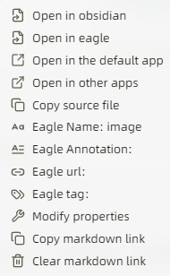

# Port Number and Library Path Configuration

When using for the first time, you need to configure the listening port number, which should be a complex four-digit number ranging from `1000` to `9999` (e.g., `6060`) to avoid conflicts with commonly used port numbers. Once set, it is not recommended to change this to ensure the stability of attachment links.

Additionally, you should configure the location of the Eagle library. Select the library in the top-left corner of the Eagle application and copy the path, for example: ```D:\onedrive\eagle\Library```.

Since Obsidian and Eagle might exist on different computers via sync methods like OneDrive, Nut Cloud, or hard drives, to ensure effective linking and avoid repeatedly changing settings, this plugin supports multiple addresses for Eagle libraries.

For instance, on Computer A, the Eagle library might be located at ```H:\directory\example.Library```, and on Computer B, it might be at ```E:\xxxx\example.Library```. The content is the same, but they are located at different addresses.

Once set up, the system will automatically map the local server to ```D:\xxxx\eagle\Library``` when using Computer A, and to ```E:\xxxx\Library``` when using Computer B, ensuring better maintenance of attachment links.


# From Eagle to Obsidian

Currently, attachments can be moved from Eagle to Obsidian through copying and dragging.


This is applicable to attachments of all formats, such as `pdf`, `png`, `mp4`, `url`, etc. For image files like `png` and `jpg`, the copied format will be ``````, allowing preview in Obsidian. Other file types will appear as link formats like ```[image.png|700](http://localhost:6060/images/M7G6FALW4.info)```.

## Locating Eagle Images in Obsidian

Right-click on an image in Eagle, choose to copy the link, then open Obsidian. Use ```Ctrl+P``` to activate the ```EagleBridge:eagle-jump-obsidian``` functionality (which can be assigned a shortcut key) and paste the link to locate the image.


## Alternative Retrieval Method

See the section on integration with Obsidian Advanced URI.

# From Obsidian to Eagle

Currently, attachments can be copied and dragged from a local source into Obsidian, and the plugin will automatically upload them to Eagle. Images can be previewed directly; occasionally, due to loading issues, images might not display immediately. Press enter after the link to display them normally.


You can set the ```Eagle Folder ID``` option to specify a folder in Eagle to upload the local files to.


URLs can also be uploaded and managed, an optional feature that can be toggled on or off in the settings.


- **Advantages**:
  - Uploading URLs allows for managing online resources within Obsidian, achieving an all-in-one management for all types of resources.
- **Disadvantages**:
  - These links become local server links, which might be lost when sharing documents (similarly, links for PDFs, MP4s, etc., cannot be opened. Future plans include a new feature to export all attachments (including URLs) associated with a `.md` document as individual folders, replacing links with ones that are easier to share).
  - There is a delay of about 10 seconds as Eagle parses the URL for fetching cover images, during which performing other tasks may cause errors.
  - Users may prefer not all URLs to be managed.
- **Additional Notes**:
  - The switch affects only URL uploads from Obsidian to Eagle. Links from Eagle to Obsidian can be loaded directly and aren't affected by this option. Since covers have already been fetched, the process is faster and smoother. It is recommended to turn off URL uploads and only paste links that need to be managed into Obsidian via Eagle.


# Operations in Obsidian

## Image Zoom Preview

Clicking the right half of an image allows for zoomed preview.


## Default Image Size Adjustment

Default image insertion size can be adjusted in the settings under ```image size```.


## Options Menu

For images in format ``````, right-clicking and holding opens the options menu. For link format ```[image.png|700](http://localhost:6060/images/M7G6FALW5.info)```, click to open options.


### Option Descriptions

- **Open in Obsidian**: Opens the attachment in Obsidian's default way. With the core plugin Web Viewer enabled, URLs can be opened in Obsidian, supporting previews for images, videos, audio, and PDFs. Unsupported formats (like PPT, Word) can't be previewed.
- **Open in Eagle**: Previews the attachment in Eagle, aiding quick and convenient image modifications and operations through Eagle's other plugins.
- **Open in the default app**: Opens the attachment using the system's default opening method.
- **Open in other apps**: Opt to open the attachment with other apps, like Photoshop.
- **Copy source file**: Copies the attachment for sharing or moving.
- **Eagle Name**: Shows and copies the attachment name. It also displays annotation, URL, and tags.
- **Modify properties**: Modify attachment annotation, URL, and tags. Use a comma `,` to separate tags.
- **Copy markdown link**: Makes it easy to reference links in other documents.
- **Clear markdown link**: Quickly removes the attachment link.



## Attachment Synchronization and `.md` Tags

After finishing an article, use ```Ctrl+P``` to search for ```EagleBridge: synchronized-page-tabs``` (or bind to a hotkey) and synchronize attachment tags with those in the `.md` file.


# Integration with Obsidian Advanced URI

## Manage all attachments in the current `.md` document

Set Obsidian Advanced URI’s vault to ID by obtaining the current vault's ID link, e.g., ```obsidian://adv-uri?vault=adbba5532cfb5f8d&uid=c5b638b9-253b-4491-891d-3d3b3633e634```, where the vault ID is ```adbba5532cfb5f8d``` and the `.md` file's ID is ```c5b638b9-253b-4491-891d-3d3b3633e634```. Enter the vault ID into the settings under ```Obsidian Store ID```. Later, enable ```Synchronizing advanced URL as a tag``` in settings and execute ```EagleBridge: synchronized-page-tabs``` to have the `.md` file's ID as ```c5b638b9-253b-4491-891d-3d3b3633e634``` a tag. This allows searching in Eagle for projects with that tag, displaying all related attachments.

## Locate Eagle Images in Obsidian (Alternative Method)

If using Obsidian Advanced URI and storing the URI as the image tag, you can copy the `.md` file ID from the image tag and paste it into ```EagleBridge:eagle-jump-obsidian``` to locate the corresponding `.md` document.

