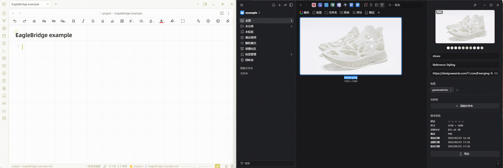

# 填写端口号和库路径配置

在首次使用时，需要配置监听端口号，范围在 `1000` 到 `9999` 之间，并尽量选择复杂的数值（例如 `6060`）以避免重复。一旦设置，该数值不建议修改以确保附件链接的稳定性。

此外，还需设置 Eagle 软件库的位置。在 Eagle 软件中选择左上角的库，复制路径，例如：```D:\onedrive\eagle\Library```。

由于 Obsidian 和 Eagle 可能通过同步、OneDrive、坚果云或硬盘存在于不同的电脑上，为了确保能够有效链接并避免重复修改设置，该插件支持 Eagle 库的多地址设置。

例如，在 A 电脑上，Eagle 库位于 ```H:\directory\example.Library```，而在 B 电脑上，Eagle 位于 ```E:\xxxx\example.Library```，两个库内容相同但位于不同地址。

配置完成后，当使用 A 电脑时，系统将自动将本地服务器映射到 ```D:\xxxx\eagle\Library```；当使用 B 电脑时，系统将映射到 ```E:\xxxx\Library```，从而更好地维护附件链接。


# 从 Eagle 到 Obsidian

当前支持复制和拖拽两种方式将附件从 Eagle 移动到 Obsidian。



适用于所有格式的附件，例如 `pdf`、`png`、`mp4`、`url` 等。对于图片类文件（`png`、`jpg`），复制后格式为 ``````，可在 Obsidian 中嵌入预览。而其他文件类型会显示为链接形式 ```[image.png|700](http://localhost:6060/images/M7G6FALW4.info)```。

## 检索 Eagle 图片在 Obsidian 中的位置

在 Eagle 中右键图片，选择复制链接，然后在 Obsidian 中使用 ```Ctrl+P``` 并选择功能 ```EagleBridge：eagle-jump-obsidian```（可以绑定快捷键），粘贴对应链接，找到图片。


## 另一种检索方式

参考本文后的 Obsidian Advanced URI 联动介绍。

# 从 Obsidian 到 Eagle

当前支持通过复制和拖拽将附件从本地直接导入 Obsidian，插件会自动上传到 Eagle。图片可直接预览，有时因加载问题可能不会立即显示，需在链接后按回车即显示正常。


您可以设置 ```Eagle Folder ID``` 选项，将本地上传的文件指定到 Eagle 的特定文件夹。


对于 URL，也可以进行上传管理，这是一项可选设置，可以在设置中打开或关闭。


- **优势**：
  - 上传 URL 的优点是可以在 Obsidian 中管理在线资源，实现对所有类型资源的统一管理。
- **缺点**：
  - 这种链接转换为本地服务器链接后，共享文档时链接会丢失。（类似地，PDF、MP4等的链接也无法访问。计划未来推出新功能，实现导出带有所有相关附件（包括 URL）的 `.md` 文档至独立文件夹，并替换链接为更便于共享的形式。）
  - 上传 URL 后，Eagle 解析以获取封面会有约 10 秒的延时，可能导致错误。
  - 用户可能不希望所有 URL 都被管理。
- **补充说明**：
  - 此开关仅针对 URL 从 Obsidian 上传到 Eagle。在 Eagle 中的链接可以直接加载到 Obsidian，不受这一开关影响。由于已经加载过封面，过程快速流畅。建议关闭 URL 上传，仅将需要管理的链接从 Eagle 加载到 Obsidian。


# 在 Obsidian 中的操作

## 图片放大预览

点击图片右半部分可实现放大预览。


## 默认图片尺寸调整

可通过设置中的 ```image size``` 调整插入图片的默认尺寸。


## 选项菜单

对于 `````` 格式的图片，通过右键持续按住可打开选项菜单。对于链接格式 ```[image.png|700](http://localhost:6060/images/M7G6FALW5.info)```，通过左键点击可打开选项菜单。


### 选项说明

- **Open in Obsidian**: 使用 Obsidian 默认方式打开附件。启用 Obsidian 核心插件 Web Viewer 时，可在 Obsidian 中打开网址，并预览图片、视频、音频、PDF。对于 Web 不支持的格式（如 PPT、Word 等），将无法预览。
- **Open in Eagle**: 在 Eagle 中预览附件，有助于利用其他插件，例如 AI 去背景和放大等快速修改图片，实时同步 Obsidian 中对应显示。
- **Open in the default app**: 根据系统默认打开方式打开附件。
- **Open in other apps**: 选择其他应用打开附件，例如 Photoshop。
- **Copy source file**: 复制附件以便分享或移动。
- **Eagle Name**: 显示并复制附件名称。同时显示附件的注释、URL、标签等信息。
- **Modify properties**: 修改附件的注释、URL 和标签。标签用英文`,`分隔。
- **Copy markdown link**: 便于在其他文档中调用附件链接。
- **Clear markdown link**: 快速删除附件链接。

## 附件同步和`.md`中的标签

文章撰写完成后，可通过```Ctrl+P```搜索```EagleBridge: synchronized-page-tabs```（或绑定快捷键）实现附件标签与`.md`中标签的一致。


# 与 Obsidian Advanced URI 联动

## 管理当前`.md`文档中的所有附件

将 Obsidian Advanced URI 的 Vault 设置为 ID，通过获取当前仓库的 ID 链接，例如 ```obsidian://adv-uri?vault=adbba5532cfb5f8d&uid=c5b638b9-253b-4491-891d-3d3b3633e634```，其中仓库 ID 为```adbba5532cfb5f8d```和`.md`文件的 ID 为```c5b638b9-253b-4491-891d-3d3b3633e634```。将仓库 ID 填入设置栏```Obsidian Store ID```后，打开设置中的```Synchronizing advanced URL as a tag```选项，执行```EagleBridge: synchronized-page-tabs```，可在 Eagle 中搜索含有该标签的项目，以展示`.md`中的所有相关附件。

## 检索 Eagle 图片在 Obsidian 中的位置（另一种方式）

如果使用了 Obsidian Advanced URI 并将 URI 作为图片标签储存，可复制图片标签中的`.md`文件 ID ，然后在```EagleBridge：eagle-jump-obsidian```中粘贴 ID，实现跳转到对应的`.md`文档。

